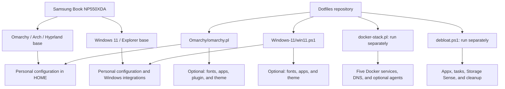
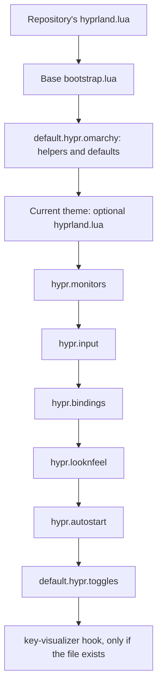
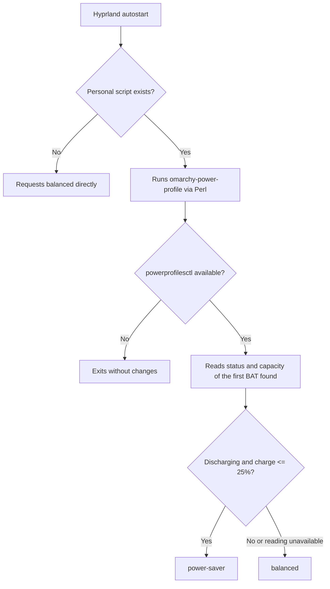
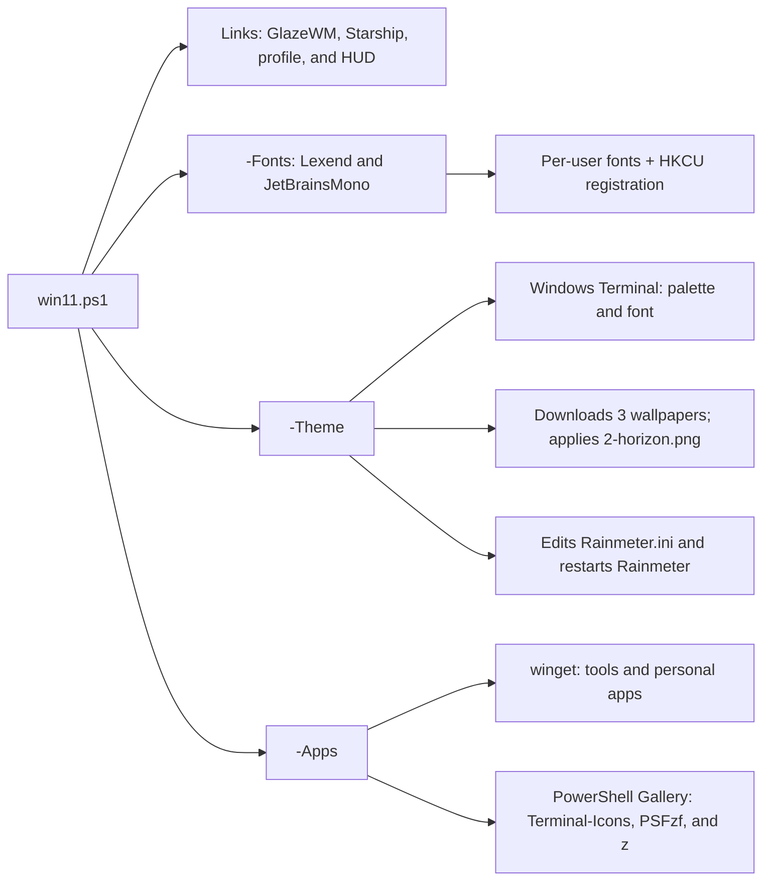
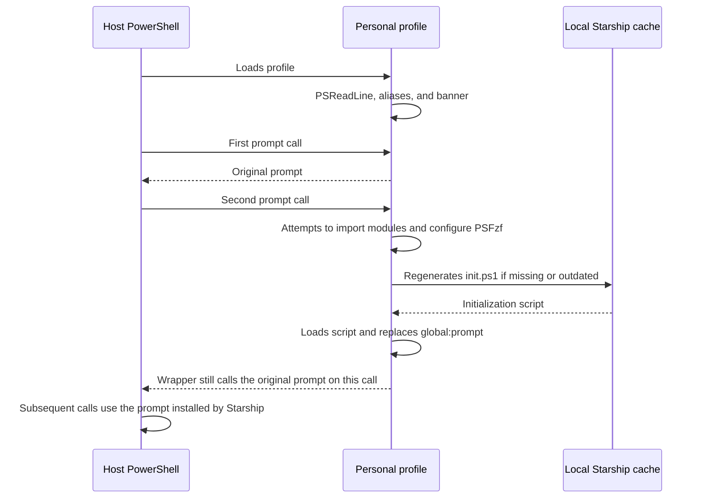
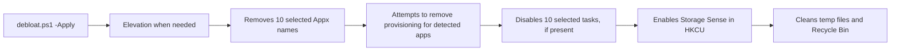
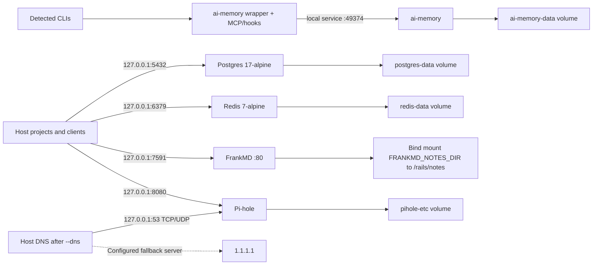
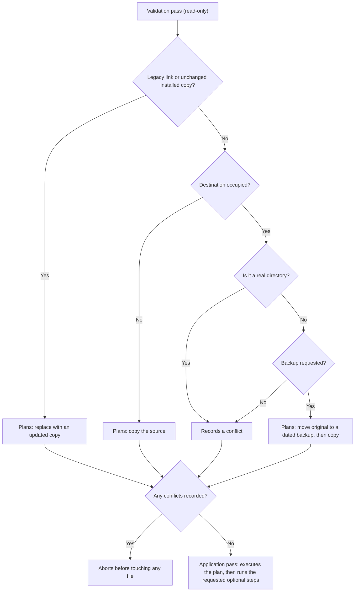

# Architecture and modifications to the base system

## Scope and evidence

This document is maintained alongside the installers and scripts it
describes and was last synced with the codebase on 2026-09-17 (commit
`6d7812d`): installers, helper scripts, configuration, Compose, environment
examples, reports, and documentation. It is not a frozen snapshot — the code
is the reference for the behavior described below, and any difference
between this document and the scripts is a documentation bug to fix rather
than evidence of drift.

The Linux base compared against was the local package **Omarchy 4.0.3-1**, specifically
`/usr/share/omarchy/config/hypr/`, `default/hypr/`, and `shell/Commons/Color.qml`.
Those files were only read. The repository does not pin an Omarchy version;
this comparison does not represent every version of the distribution. On Windows,
the reference is the versioned snapshot **Windows 11 Home Single Language build
26200**; there is no clean image or Windows execution in this analysis. The Windows
changes were identified from the scripts, without claiming a complete OS diff.

The [Linux](../Omarchy/hardware/inxi-Fz.txt) and
[Windows](../Windows-11/hardware/hardware-profile.txt) snapshots record an i5-1135G7,
4 cores/8 threads, 16 GiB physical RAM, Iris Xe, and a 1920×1080 panel. The SSD is a
256 GB (marketing) drive, roughly 238.5 GiB usable. The 30.7% battery health
figure belongs to the Linux snapshot; the Windows report could not query it.
Btrfs, swapfile, zram, kernel, and drivers are observed state, not changes
implemented by these dotfiles.

## Project layers

The arrows represent dependencies and configuration application, not a
dual-boot installation. No script configures boot switching between the two systems.
`--all`/`-All` do not include Docker, debloat, or hardware updates.

## Omarchy: inheritance and differences

The main configuration preserves Omarchy's bootstrap and defaults.
The theme is loaded inside `default.hypr.omarchy`; personal configuration is
loaded afterward. Values that are not redefined remain dependent on the base and the theme.

| Area / source in `Omarchy/home/` | Local base consulted | Modification or reaffirmation |
|---|---|---|
| [.config/hypr/monitors.lua](../Omarchy/home/.config/hypr/monitors.lua) | `GDK_SCALE=2`, `auto` scale | Both set to `1`; keeps generic output, `preferred` mode, and `auto` position |
| [.config/hypr/input.lua](../Omarchy/home/.config/hypr/input.lua) | Layout derived from `/etc/vconsole.conf`; sensitivity `0`; natural scroll off | Global `us/intl`, Caps as Compose, sensitivity `0.3`, natural scroll and disable-while-typing enabled; 3-finger horizontal gesture |
| Same file, devices | No personal rules of this kind | Internal keyboard `br/abnt2`; two EK75 interfaces set to `us/intl` |
| Same file, repeat rate | Rate `40`, delay `250`, Num Lock on | Reaffirms the base values; not an additional optimization |
| [.config/hypr/looknfeel.lua](../Omarchy/home/.config/hypr/looknfeel.lua) | Gaps `5/10`, border `2`, rounding `0`, shadow and blur off before the theme | Keeps the gaps; border `1`, rounding `8`, shadow range `12`/render power `2`, blur size `4`/passes `2`; animations inherited |
| [.config/hypr/bindings.lua](../Omarchy/home/.config/hypr/bindings.lua) | Shortcuts loaded from the defaults | Removes `Super+Shift+C`, `E`, `Alt+E`, and `Slash`; adds no replacements |
| [.config/hypr/autostart.lua](../Omarchy/home/.config/hypr/autostart.lua) | Template with no active personal autostart | Runs the Perl power-profile selector; falls back to `powerprofilesctl set balanced` |
| [.config/hypr/hyprland.lua](../Omarchy/home/.config/hypr/hyprland.lua) | Chain of defaults and overrides | Adds a conditional `felixzsh.key-visualizer` hook; the installer does not install that plugin |

Blur and shadow are **enabled on top of defaults that turn them off**. The values
express a visual choice; there is no power-consumption or performance benchmark in the
repository demonstrating savings relative to the base system.

### Interface, terminals, and tools

| Files under `Omarchy/home/.config/` | Effect declared by the configuration |
|---|---|
| [fontconfig/fonts.conf](../Omarchy/home/.config/fontconfig/fonts.conf) | Prefers Lexend for `sans-serif`, `system-ui`, `-apple-system`, and `BlinkMacSystemFont`; a minimum-size rule of `20` for fonts that pass through this mechanism |
| [gtk-3.0/settings.ini](../Omarchy/home/.config/gtk-3.0/settings.ini), [gtk-4.0/settings.ini](../Omarchy/home/.config/gtk-4.0/settings.ini) | `gtk-font-name=Lexend 20` |
| [omarchy/shell.toml](../Omarchy/home/.config/omarchy/shell.toml) | `[font] base-size=20`; the local shell implementation merges this file over the theme |
| [alacritty/alacritty.toml](../Omarchy/home/.config/alacritty/alacritty.toml) | Imports the current theme; JetBrainsMono Nerd Font `20`, padding `14`, no decorations; OSC52 CopyPaste and clipboard/Enter shortcuts |
| [foot/foot.ini](../Omarchy/home/.config/foot/foot.ini) | Imports the current theme; same family/size/padding; 10k lines of scrollback, non-blinking cursor, clipboard and Enter sequences |
| [btop/btop.conf](../Omarchy/home/.config/btop/btop.conf) | `current` theme, 2-second update interval, CPU/memory/network/processes, temperature, and swap |
| [starship.toml](../Omarchy/home/.config/starship.toml) | Directory, branch, and Git state in cyan; `200 ms` timeout; some Git states hidden |
| [omarchy/rss-reader.json](../Omarchy/home/.config/omarchy/rss-reader.json) | Five feeds in the Programming folder; 1-minute refresh, `maxItems=200`, `retentionItems=1000`, `scrollStep=90` |

The `20` size is interpreted by each consumer; it is not a guarantee of identical
physical size across applications. The fontconfig setup does not prove that
applications ignoring its rules adopt this floor. There is no versioned
configuration for Kitty or Ghostty, even though they appear in the fonts documentation.

The [installer](../Omarchy/omarchy.pl) always processes the copies before the optional steps:

| Option | Change external to the file set |
|---|---|
| `--fonts` | Downloads Lexend Regular/Bold from Google Fonts into `~/.local/share/fonts/lexend` and refreshes the cache; does not install JetBrainsMono |
| `--apps` | Removes HEY/Basecamp and the 1Password service when detected; installs PrismLauncher, Bitwarden, AppFlowy, and CurseForge; registers Amazon Shopping, Mercado Livre, Pinterest, Z Ai, WebMotors, Panini Brasil, GitHub, GitLab, Codeberg, Copilot, Claude, ChatGPT, Grok, and Gemini |
| `--plugin` | Adds Feader-RSS or enables an existing installation on the right side |
| `--theme` | Installs Sword Art Omarchy if absent and applies it; preserves any broken theme link |
| `--all` | Fonts → apps → plugin → theme, after the copies |

### Power: a one-time decision at session start

Source: [omarchy-power-profile](../Omarchy/home/.local/bin/omarchy-power-profile).
The threshold is remaining battery charge, not CPU load nor battery health.
There is no timer, daemon, or continuous reaction to a power-source change; a new evaluation
requires running the script again.

## Windows: components added and their targets

Main source: [win11.ps1](../Windows-11/win11.ps1). The map does not literally replicate
the `home/` tree, unlike the Linux installer.

| Source in `Windows-11/home/` | Destination / application |
|---|---|
| [glazewm/config.yaml](../Windows-11/home/glazewm/config.yaml) | Copied to `%USERPROFILE%\.glzr\glazewm\config.yaml`; tiling, 9 workspaces, `6/10 px` gaps, cyan/gray borders, rounded corners, and Super shortcuts |
| [starship.toml](../Windows-11/home/starship.toml) | Copied to `%USERPROFILE%\.config\starship.toml`; content identical to Linux in this analysis |
| [powershell/Microsoft.PowerShell_profile.ps1](../Windows-11/home/powershell/Microsoft.PowerShell_profile.ps1) | Copied to the `$PROFILE` of the host running the installer; PSReadLine, aliases, colors, modules, and deferred Starship initialization |
| [rainmeter/AincradHUD](../Windows-11/home/rainmeter/AincradHUD/HUD.ini) | Directory copied to `%USERPROFILE%\Documents\Rainmeter\Skins\AincradHUD`; clock, CPU, RAM, C: drive, and network traffic |
| [windows-terminal/sword-art-online.scheme.json](../Windows-11/home/windows-terminal/sword-art-online.scheme.json) | `-Theme` merges the palette into the first `settings.json` found and sets the default font; not a symlink |

`-All` runs copies → fonts → apps/modules → theme, so Windows Terminal and
Rainmeter are already installed by the time the theme step configures them on
a fresh machine. Rainmeter itself still needs to be launched once to create
its INI file before `Set-RainmeterHud` can edit it; the script detects the
missing file and warns instead of failing, and running `-Theme` again
afterward resolves the pending step. There is no GlazeWM autostart provisioning in the script;
its `startup_commands` is also empty. PowerToys Run is installed, but the
shortcut suggested in the README requires manual configuration.

`Install-Apps` lists GlazeWM, Windows Terminal, PowerToys, Starship, Rainmeter,
fzf, Steam, PrismLauncher, Git, Claude, Codex CLI, Bitwarden, Obsidian,
AppFlowy, VS Code, Go, Node.js, Python 3.13, and Lua. btop4win is mentioned in the README
but does not appear in this install list.

### PowerShell initialization

The trigger implemented is a count of `prompt` calls, not
`PowerShell.OnIdle`. The import is attempted once per session. The profile
also includes CompletionPredictor and F7History, which the installer does not install;
`lint` points to Invoke-ScriptAnalyzer, whose dependency is also not
provisioned. The cache lives at `%LOCALAPPDATA%\powershell-starship-cache`.

### Separate debloat

[debloat.ps1](../Windows-11/scripts/debloat.ps1) only simulates without `-Apply`.
With that option, it requests UAC elevation when needed and goes through:

The list includes Clipchamp, Bing News/Weather, Get Help, Solitaire, Feedback Hub,
Outlook, Teams, Copilot, and Family. The tasks cover Application Experience,
Autochk, CEIP, DiskDiagnostic, Feedback, and Windows Error Reporting. The script
does not change the power plan nor touch Defender/Windows Update. Provisioning removal
is only attempted when the app was found for the current user.
There is no backup of the removals nor a restore integrated into `win11.ps1`.

## Docker: optional services, persistence, and DNS

Sources: [Compose](../Omarchy/docker/docker-compose.yml),
[orchestrator](../Omarchy/scripts/docker-stack.pl), and
[documented variables](../Omarchy/docker/.env.example).

There is no declared link between FrankMD or ai-memory and Postgres/Redis: they are
independent services in the Compose file, with no `depends_on`. All use
`restart: unless-stopped`. FrankMD, ai-memory, and Pi-hole use `latest` images;
exact reproducibility is not pinned by digest. Published ports are
restricted to loopback; this does not isolate the containers from each other.

- `--up`: creates the notes folder; creates `.env` only if absent, with
  random secrets and `0600` permissions; runs `docker compose up -d`.
- `--agents`: fetches the wrapper if needed, verifies its SHA-256, and delegates the
  MCP/hooks installation to claude, codex, gemini, cursor-agent, opencode, and grok
  detected on the PATH. The actual files changed depend on the external wrapper.
- `--dns`: waits for Pi-hole to become healthy for up to 20 checks; sends
  `127.0.0.1 1.1.1.1` to the native `omarchy dns Custom` command.
- `--dns-revert`: delegates to `omarchy dns DHCP`. The fallback server does not guarantee
  that every query goes through Pi-hole; this document records the configured list.
- `--dns-hook` (also run automatically by `--up`): installs two independent
  triggers for the same recovery script
  (`scripts/hooks/pihole-dns-recover.sh`) — an Omarchy `post-boot` hook, and
  a `systemd --user` service (`pihole-dns-resume.service`, running
  `pihole-dns-resume-watch.sh`) that watches `login1`'s `PrepareForSleep`
  D-Bus signal and reruns the recovery on every resume from suspend. The
  post-boot hook alone only fires once per reboot; on a laptop this machine
  can spend many hours awake across several suspend/resume cycles without
  ever rebooting, and `resolved` does not re-evaluate `127.0.0.1` on its own
  after a resume, so DNS was observed to stay stuck on the `1.1.1.1`
  fallback for the rest of the session after the first resume. Both triggers
  are unprivileged D-Bus/user-service mechanisms; neither needs a password
  prompt.
- `--down`: runs Compose down without `--volumes`; does not revert DNS nor hooks.
  `--status` only queries the containers.

`--notes-dir` is written to `.env` only during its creation. With an existing `.env`,
a new folder can be created without changing the mount used by
Compose. The local `.env` is ignored by Git and its values are not part of this analysis.

## Installation, conflicts, and restore scope

The flowchart describes the common path; `--dry-run`/`-DryRun` only report the
planned actions. **The installation is transactional in two passes**: validation is
read-only and collects every conflict before anything is touched, so a conflict on
one file aborts the whole run without any copy or backup having been created.
If an unexpected failure happens during the application pass itself (a race
condition, a permission change), the error message lists which changes were
already applied instead of implying nothing happened.

| Operation | Omarchy | Windows |
|---|---|---|
| Source → destination | Relative path of each file under `home/` preserved in HOME | Explicit map of four entries, including one directory |
| Backup | `.local/state/dotfiles/backups/YYYYmmdd-HHMMSS` under the destination | Same pattern, plus a `manifest.json` recording each item's real destination and a post-install content hash |
| Restore selection | Most recent snapshot | Most recent snapshot |
| Destination protection on restore | Validates all before applying; accepts absent files, legacy links, or copies matching the installed content hash | Validates all before applying; aborts if a destination's content hash no longer matches what was recorded at install time |
| Restored path | Relative to HOME, compatible with link backups | Read from `manifest.json`, matching the destinations used by `Install-Files`, `Set-WindowsTerminalTheme`, and `Set-RainmeterHud` |
| Scope | Entries present in the snapshot, preserving the copy | Copy of files from the snapshot, using the manifest map |

`win11.ps1 -Restore` now consults an explicit `manifest.json` written next to the
snapshot instead of reconstructing destinations from `$Target` and the backup's
relative path. Each backed-up item (GlazeWM, Starship, the PowerShell profile,
`AincradHUD`, the Windows Terminal `settings.json`, and `Rainmeter.ini`) records
its real destination and a SHA-256 hash of its post-install content. Restore
validates every entry against the current file content first and aborts with no
changes if anything was modified after installation, then only proceeds to
overwrite files once that first pass finds no conflicts.

No restore is a complete uninstall: new copies without a backup are not
removed by this mechanism; packages, fonts, theme selection, wallpapers,
DNS, hooks, and Docker data require specific handling. On Linux, even
special theme backups may fail restore validation if the
external installer created a real directory at the destination.

## Divergences and maintenance points

| Finding | Evidence and consequence |
|---|---|
| HUD palette is not identical to the one advertised | The HUD uses cyan `90,220,255` (`#5adcff`), Consolas font, and its own sizes; it does not automatically share the terminal's Lexend/cyan `#3ee8ff` |
| Windows README described OnIdle | The code uses a `prompt` wrapper; the description was corrected in this documentation |
| Incomplete profile dependencies | CompletionPredictor, F7History, and PSScriptAnalyzer are not part of the module installation |
| Personal files are full replacements | Outside the explicit Lua inheritance/theme imports, the installer copies whole files rather than merging fields; new defaults may fail to appear |
| Fonts, theme, plugin, wrapper, and images are not fully pinned | Remote updates can produce a different result; this analysis did not audit the external content |
| Windows failure handling is partial | `winget`'s `$LASTEXITCODE` is not validated by the installer; several debloat operations silence errors; the final message does not prove each step succeeded |

## Supplementary inventory and validation

The [hardware-profile.pl](../Omarchy/scripts/hardware-profile.pl) and
[hardware-profile.ps1](../Windows-11/scripts/hardware-profile.ps1) scripts collect data
via `inxi` and CIM/WMI, respectively. With no save option, they print a report;
`--save`/`-Save` replace the versioned snapshot. They do not configure hardware.

[cpanfile](../Omarchy/cpanfile) declares Perl 5.36; the scripts use core
modules. [.perltidyrc](../.perltidyrc) configures formatting. The
[root](../.gitignore) and [Omarchy](../Omarchy/.gitignore) ignore files exclude
secrets, noise, and tool artifacts. The READMEs for
[Omarchy](../Omarchy/README.md), [Windows](../Windows-11/README.md), and
[fonts](../Omarchy/fonts/README.md) complement the operational details; where they diverge,
the behavior identified in the code above takes precedence.

This analysis used a static read of every versioned file and a targeted lookup
against the installed Omarchy base. Documentation verification covers relative
links, Mermaid blocks, and whitespace. No installers, debloat, DNS changes,
desktop reloads, or services were executed. Mermaid's visual rendering
depends on the viewer; it was not validated with a local renderer.
