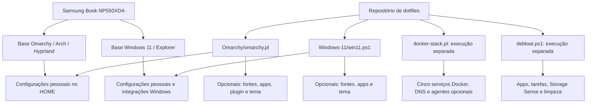
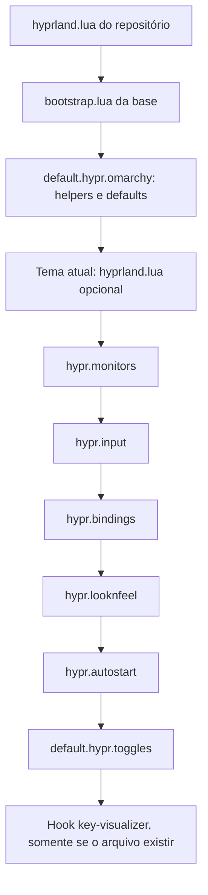
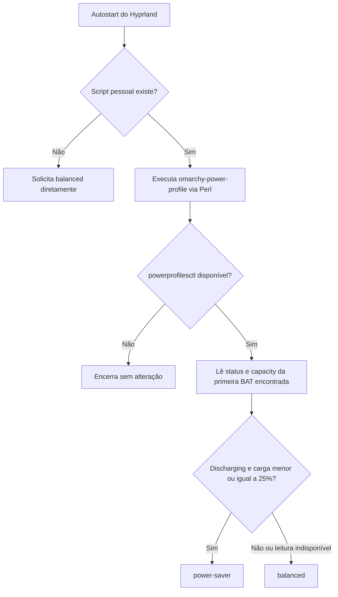
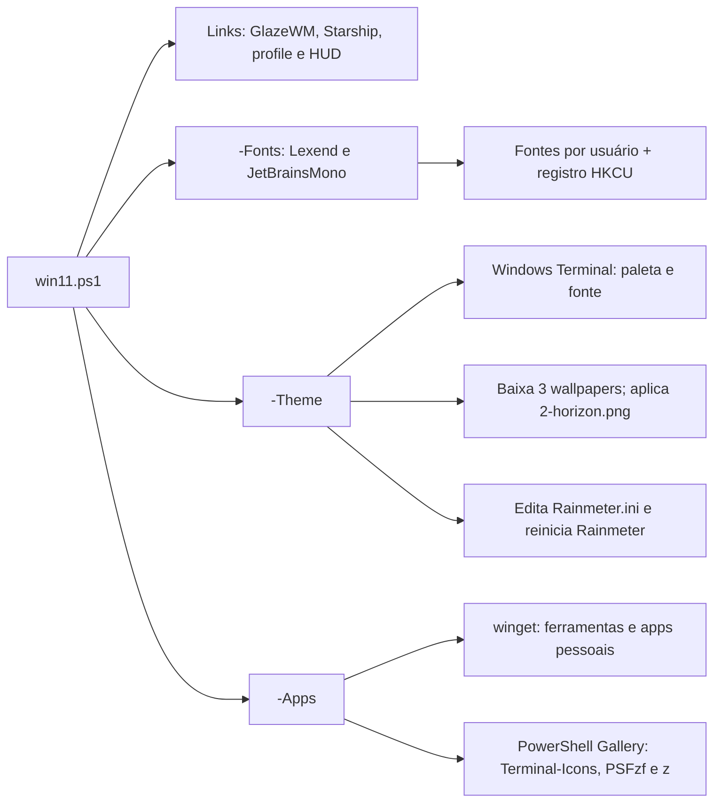
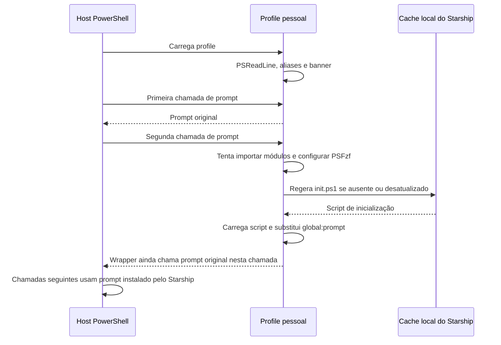
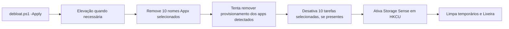
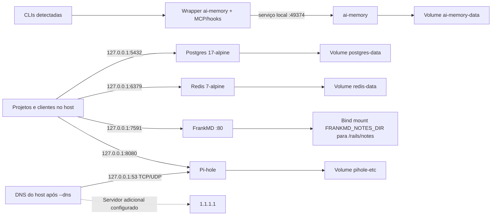
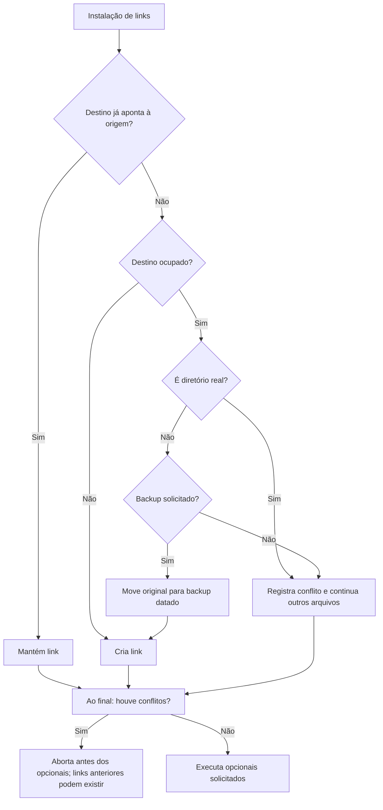

# Arquitetura e modificações sobre o sistema base

## Escopo e evidências

Análise de 13/09/2026 sobre o commit `6b70aaf`, abrangendo os 38 arquivos
versionados anteriores a esta documentação: instaladores, scripts auxiliares,
configurações, Compose, exemplos de ambiente, relatórios e documentação.
O código é a referência para o comportamento descrito abaixo.

A base Linux comparada foi o pacote local **Omarchy 4.0.3-1**, especialmente
`/usr/share/omarchy/config/hypr/`, `default/hypr/` e `shell/Commons/Color.qml`.
Esses arquivos foram apenas lidos. O repositório não fixa uma versão do Omarchy;
esta comparação não representa todas as versões da distribuição. No Windows,
a referência é o snapshot versionado **Windows 11 Home Single Language build
26200**; não há imagem limpa nem execução Windows nesta análise. As alterações
Windows foram identificadas nos scripts, sem alegar um diff completo do SO.

Os [snapshots Linux](../Omarchy/hardware/inxi-Fz.txt) e
[Windows](../Windows-11/hardware/hardware-profile.txt) registram i5-1135G7,
4 núcleos/8 threads, 16 GiB físicos, Iris Xe e painel 1920×1080. O SSD é de
256 GB comerciais, aproximadamente 238,5 GiB. A saúde de bateria de 30,7%
pertence ao snapshot Linux; o relatório Windows não conseguiu consultá-la.
Btrfs, swapfile, zram, kernel e drivers são estado observado, não alterações
implementadas por estes dotfiles.

## Camadas do projeto

As setas representam dependências e aplicação de configurações, não uma
instalação de dual boot. Nenhum script configura o boot entre os dois sistemas.
`--all`/`-All` não incluem Docker, debloat ou atualização de hardware.

## Omarchy: herança e diferenças

A configuração principal preserva o bootstrap e os defaults do Omarchy.
O tema entra dentro de `default.hypr.omarchy`; as configurações pessoais são
carregadas depois. Valores não redefinidos continuam dependentes da base e do tema.

| Área / fonte em `Omarchy/home/` | Base local consultada | Modificação ou reafirmação |
|---|---|---|
| [.config/hypr/monitors.lua](../Omarchy/home/.config/hypr/monitors.lua) | `GDK_SCALE=2`, escala `auto` | Ambos em `1`; mantém saída genérica, modo `preferred` e posição `auto` |
| [.config/hypr/input.lua](../Omarchy/home/.config/hypr/input.lua) | Layout derivado de `/etc/vconsole.conf`; sensibilidade `0`; scroll natural desligado | Global `us/intl`, Caps como Compose, sensibilidade `0.3`, scroll natural e desativação do touchpad ao digitar; gesto horizontal de 3 dedos |
| Mesmo arquivo, dispositivos | Sem estas regras pessoais | Teclado interno `br/abnt2`; duas interfaces EK75 `us/intl` |
| Mesmo arquivo, repetição | Taxa `40`, atraso `250`, Num Lock ativo | Reafirma valores da base; não é uma otimização adicional |
| [.config/hypr/looknfeel.lua](../Omarchy/home/.config/hypr/looknfeel.lua) | Gaps `5/10`, borda `2`, rounding `0`, sombra e blur desligados antes do tema | Mantém gaps; borda `1`, rounding `8`, sombra range `12`/render power `2`, blur size `4`/passes `2`; animações herdadas |
| [.config/hypr/bindings.lua](../Omarchy/home/.config/hypr/bindings.lua) | Atalhos carregados dos defaults | Remove `Super+Shift+C`, `E`, `Alt+E` e `Slash`; não adiciona substitutos |
| [.config/hypr/autostart.lua](../Omarchy/home/.config/hypr/autostart.lua) | Template sem autostart pessoal ativo | Executa seletor de energia em Perl; fallback `powerprofilesctl set balanced` |
| [.config/hypr/hyprland.lua](../Omarchy/home/.config/hypr/hyprland.lua) | Cadeia de defaults e overrides | Acrescenta hook condicional `felixzsh.key-visualizer`; instalador não instala esse plugin |

Blur e sombra estão **ativados sobre defaults que os desativam**. Os valores
expressam uma escolha visual; não há benchmark de consumo ou desempenho no
repositório que demonstre economia relativa ao sistema base.

### Interface, terminais e ferramentas

| Arquivos em `Omarchy/home/.config/` | Efeito declarado pela configuração |
|---|---|
| [fontconfig/fonts.conf](../Omarchy/home/.config/fontconfig/fonts.conf) | Prefere Lexend para `sans-serif`, `system-ui`, `-apple-system` e `BlinkMacSystemFont`; regra de tamanho mínimo `20` para fontes que passam por esse mecanismo |
| [gtk-3.0/settings.ini](../Omarchy/home/.config/gtk-3.0/settings.ini), [gtk-4.0/settings.ini](../Omarchy/home/.config/gtk-4.0/settings.ini) | `gtk-font-name=Lexend 20` |
| [omarchy/shell.toml](../Omarchy/home/.config/omarchy/shell.toml) | `[font] base-size=20`; a implementação local do shell mescla esse arquivo sobre o tema |
| [alacritty/alacritty.toml](../Omarchy/home/.config/alacritty/alacritty.toml) | Importa tema atual; JetBrainsMono Nerd Font `20`, padding `14`, sem decoração; OSC52 CopyPaste e atalhos de clipboard/Enter |
| [foot/foot.ini](../Omarchy/home/.config/foot/foot.ini) | Importa tema atual; mesma família/tamanho/padding; 10 mil linhas de histórico, cursor sem piscar, clipboard e sequências de Enter |
| [btop/btop.conf](../Omarchy/home/.config/btop/btop.conf) | Tema `current`, atualização de 2 segundos, CPU/memória/rede/processos, temperatura e swap |
| [starship.toml](../Omarchy/home/.config/starship.toml) | Diretório, branch e estado Git em ciano; timeout `200 ms`; alguns estados Git ocultos |
| [omarchy/rss-reader.json](../Omarchy/home/.config/omarchy/rss-reader.json) | Cinco feeds na pasta Programming; atualização de 1 minuto, `maxItems=200`, `retentionItems=1000`, `scrollStep=90` |

O tamanho `20` é interpretado por cada consumidor, não uma garantia de tamanho
físico idêntico entre aplicações. A configuração fontconfig não comprova que
aplicativos que ignoram suas regras adotem esse piso. Não há configuração
versionada de Kitty ou Ghostty, apesar de aparecerem na documentação de fontes.

O [instalador](../Omarchy/omarchy.pl) sempre processa os links antes dos opcionais:

| Opção | Alteração externa ao conjunto de links |
|---|---|
| `--fonts` | Baixa Lexend Regular/Bold do Google Fonts em `~/.local/share/fonts/lexend` e atualiza cache; não instala JetBrainsMono |
| `--apps` | Remove HEY/Basecamp e serviço 1Password quando detectados; instala PrismLauncher, Bitwarden, AppFlowy e CurseForge; registra Amazon Shopping, Mercado Livre, Pinterest, Z Ai, WebMotors e Panini Brasil |
| `--plugin` | Adiciona Feader-RSS ou habilita instalação existente à direita |
| `--theme` | Instala, se ausente, e aplica Sword Art Omarchy; preserva eventual link quebrado do tema |
| `--all` | Fontes → apps → plugin → tema, depois dos links |

### Energia: decisão pontual ao iniciar a sessão

Fonte: [omarchy-power-profile](../Omarchy/home/.local/bin/omarchy-power-profile).
O limite é carga restante da bateria, não carga de CPU nem saúde da bateria.
Não há timer, daemon ou reação contínua à troca de tomada; uma nova avaliação
exige outra execução do script.

## Windows: componentes acrescentados e destinos

Fonte principal: [win11.ps1](../Windows-11/win11.ps1). O mapa não replica
literalmente a árvore `home/`, diferentemente do instalador Linux.

| Origem em `Windows-11/home/` | Destino / aplicação |
|---|---|
| [glazewm/config.yaml](../Windows-11/home/glazewm/config.yaml) | Link em `%USERPROFILE%\.glzr\glazewm\config.yaml`; tiling, 9 workspaces, gaps `6/10 px`, bordas ciano/cinza, cantos arredondados e atalhos Super |
| [starship.toml](../Windows-11/home/starship.toml) | Link em `%USERPROFILE%\.config\starship.toml`; conteúdo idêntico ao Linux na análise |
| [powershell/Microsoft.PowerShell_profile.ps1](../Windows-11/home/powershell/Microsoft.PowerShell_profile.ps1) | Link no `$PROFILE` do host que executa o instalador; PSReadLine, aliases, cores, módulos e inicialização adiada do Starship |
| [rainmeter/AincradHUD](../Windows-11/home/rainmeter/AincradHUD/HUD.ini) | Link do diretório em `%USERPROFILE%\Documents\Rainmeter\Skins\AincradHUD`; relógio, CPU, RAM, disco C: e tráfego de rede |
| [windows-terminal/sword-art-online.scheme.json](../Windows-11/home/windows-terminal/sword-art-online.scheme.json) | `-Theme` mescla paleta no primeiro `settings.json` encontrado e define fonte padrão; não é symlink |

`-All` executa links → fontes → tema → apps/módulos. Portanto, numa instalação
nova, o tema pode ser pulado porque Windows Terminal/Rainmeter ainda não foram
instalados ou inicializados. O script orienta abrir Rainmeter uma vez quando
seu INI não existe; repetir `-Theme` depois resolve a etapa pendente, sujeita
às limitações abaixo. Não há provisionamento de autostart do GlazeWM no script;
seu `startup_commands` também está vazio. PowerToys Run é instalado, mas o
atalho sugerido no README requer configuração manual.

`Install-Apps` lista GlazeWM, Windows Terminal, PowerToys, Starship, Rainmeter,
fzf, Steam, PrismLauncher, Git, Claude, Codex CLI, Bitwarden, Obsidian,
AppFlowy, VS Code, Go, Node.js, Python 3.13 e Lua. btop4win é citado no README,
mas não aparece nessa lista de instalação.

### Inicialização do PowerShell

O gatilho implementado é a contagem de chamadas de `prompt`, não
`PowerShell.OnIdle`. A importação é tentada uma vez por sessão. O profile
inclui também CompletionPredictor e F7History, que o instalador não instala;
`lint` aponta para Invoke-ScriptAnalyzer, cuja dependência também não é
provisionada. O cache fica em `%LOCALAPPDATA%\powershell-starship-cache`.

### Debloat separado

[debloat.ps1](../Windows-11/scripts/debloat.ps1) apenas simula sem `-Apply`.
Com a opção, solicita elevação por UAC quando necessária e percorre:

A lista inclui Clipchamp, Bing News/Weather, Get Help, Solitaire, Feedback Hub,
Outlook, Teams, Copilot e Family. As tarefas abrangem Application Experience,
Autochk, CEIP, DiskDiagnostic, Feedback e Windows Error Reporting. O script
não troca o plano de energia nem altera Defender/Windows Update. Remoção de
provisionamento só é tentada quando o app foi encontrado para o usuário atual.
Não há backup das exclusões nem restauração integrada ao `win11.ps1`.

## Docker: serviços, persistência e DNS opcionais

Fontes: [Compose](../Omarchy/docker/docker-compose.yml),
[orquestrador](../Omarchy/scripts/docker-stack.pl) e
[variáveis documentadas](../Omarchy/docker/.env.example).

Não há ligação declarada de FrankMD ou ai-memory com Postgres/Redis: são
serviços independentes no Compose, sem `depends_on`. Todos usam
`restart: unless-stopped`. FrankMD, ai-memory e Pi-hole usam imagens `latest`;
a reprodução exata não está fixada por digest. Portas publicadas estão
restritas a loopback; isso não isola os containers uns dos outros.

- `--up`: cria pasta de notas; cria `.env` apenas se ausente, com segredos
  aleatórios e permissão `0600`; executa `docker compose up -d`.
- `--agents`: obtém wrapper se necessário, confere SHA-256 e delega instalação
  de MCP/hooks para claude, codex, gemini, cursor-agent, opencode e grok
  detectados no PATH. Os arquivos concretos alterados dependem do wrapper externo.
- `--dns`: espera Pi-hole saudável por até 20 verificações; envia
  `127.0.0.1 1.1.1.1` ao comando nativo `omarchy dns Custom`.
- `--dns-revert`: delega a `omarchy dns DHCP`. O segundo servidor não garante
  que toda consulta passe pelo Pi-hole; este documento registra a lista configurada.
- `--down`: executa Compose down sem `--volumes`; não reverte DNS nem hooks.
  `--status` apenas consulta os containers.

`--notes-dir` é gravado no `.env` apenas durante sua criação. Com `.env`
existente, uma nova pasta pode ser criada sem mudar o mount utilizado pelo
Compose. O `.env` local é ignorado pelo Git e seus valores não integram esta análise.

## Instalação, conflitos e alcance da restauração

O fluxograma descreve o fluxo comum; `--dry-run`/`-DryRun` apenas relatam as
ações. **A instalação não é transacional**: conflito em um arquivo não desfaz
links criados antes ou depois dele durante a mesma passagem.

| Operação | Omarchy | Windows |
|---|---|---|
| Origem → destino | Caminho relativo de cada arquivo em `home/` preservado no HOME | Mapa explícito de quatro entradas, incluindo um diretório |
| Backup | `.local/state/dotfiles/backups/AAAAmmdd-HHMMSS` sob destino | Mesmo padrão, mas usa nomes relativos da origem |
| Seleção de restore | Snapshot mais recente | Snapshot mais recente |
| Proteção de destino no restore | Valida todos antes de aplicar; aceita ausente ou symlink deste repo | Não verifica propriedade do destino antes de remover arquivo existente |
| Caminho restaurado | Relativo ao HOME, compatível com backup de links | Concatena `$Target` e caminho do backup; não consulta `Get-LinkMap` |
| Alcance | Entradas presentes no snapshot, preservando cópia | Cópia de arquivos do snapshot, com limitações de mapeamento |

Exemplo concreto do problema Windows: backup `glazewm/config.yaml` é restaurado
em `%USERPROFILE%\glazewm\config.yaml`, enquanto o link instalado está em
`%USERPROFILE%\.glzr\glazewm\config.yaml`. O mesmo desvio afeta Starship,
profile, Rainmeter e backups de tema. **O `-Restore` atual não deve ser tratado
como reversão funcional da instalação Windows.** A constatação é estática;
não foi aplicada correção aos scripts nesta tarefa de documentação.

Nenhum restore é uma desinstalação completa: links novos sem backup não são
removidos por esse mecanismo; pacotes, fontes, seleção de tema, wallpapers,
DNS, hooks e dados Docker exigem tratamento específico. No Linux, inclusive
backups especiais de tema podem não passar na validação do restore caso o
instalador externo tenha criado um diretório real no destino.

## Divergências e pontos de manutenção

| Constatação | Evidência e consequência |
|---|---|
| Restore Windows usa destinos incorretos | `Restore-Backups` ignora o mapa da instalação; prioridade para uma futura correção funcional |
| `-All` aplica tema antes de instalar apps | Pode deixar personalização incompleta no primeiro provisionamento |
| Rainmeter não garante reativar seção existente | `Set-RainmeterHud` acrescenta `Active=1` apenas quando a seção não existe; uma existente com `Active=0` permanece inativa |
| Paleta do HUD não é idêntica à anunciada | HUD usa ciano `90,220,255` (`#5adcff`), fonte Consolas e tamanhos próprios; não compartilha automaticamente Lexend/ciano `#3ee8ff` do terminal |
| README Windows descrevia OnIdle | Código usa wrapper de `prompt`; a descrição foi corrigida nesta documentação |
| Dependências do profile incompletas | CompletionPredictor, F7History e PSScriptAnalyzer não constam da instalação de módulos |
| Arquivos pessoais são substituições completas | Fora da herança explícita Lua/imports de tema, o instalador cria links de arquivos, não mescla campos; novos defaults podem deixar de aparecer |
| Fontes, tema, plugin, wrapper e imagens não estão fixados integralmente | Atualizações remotas podem produzir resultado diferente; esta análise não auditou o conteúdo externo |
| Tratamento de falhas Windows é parcial | `winget` não tem `$LASTEXITCODE` validado pelo instalador; várias operações do debloat silenciam erros; mensagem final não prova êxito de cada etapa |

## Inventário complementar e validação

Os scripts [hardware-profile.pl](../Omarchy/scripts/hardware-profile.pl) e
[hardware-profile.ps1](../Windows-11/scripts/hardware-profile.ps1) coletam dados
via `inxi` e CIM/WMI, respectivamente. Sem opção de gravação, imprimem relatório;
`--save`/`-Save` substituem o snapshot versionado. Não configuram hardware.

[cpanfile](../Omarchy/cpanfile) declara Perl 5.36; os scripts usam módulos do
core. [.perltidyrc](../.perltidyrc) configura formatação. Os
[ignores da raiz](../.gitignore) e [Omarchy](../Omarchy/.gitignore) excluem
segredos, ruído e artefatos de ferramentas. Os READMEs de
[Omarchy](../Omarchy/README.md), [Windows](../Windows-11/README.md) e
[fontes](../Omarchy/fonts/README.md) complementam a operação; em divergências,
valem os comportamentos identificados no código acima.

Esta análise usou leitura estática de todos os arquivos versionados e consulta
pontual da base Omarchy instalada. A verificação da documentação cobre links
relativos, blocos Mermaid e whitespace. Não foram executados instaladores,
debloat, mudanças de DNS, reload do desktop ou serviços. A renderização visual
Mermaid depende do visualizador; não foi validada por um renderizador local.
